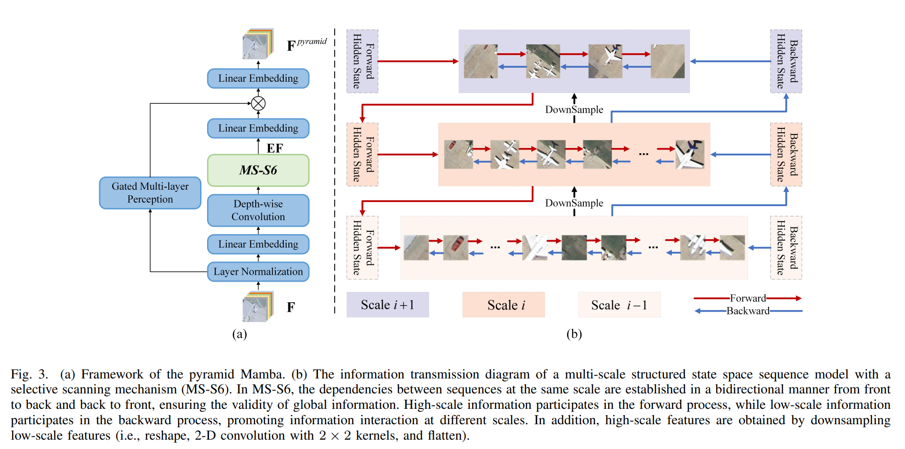
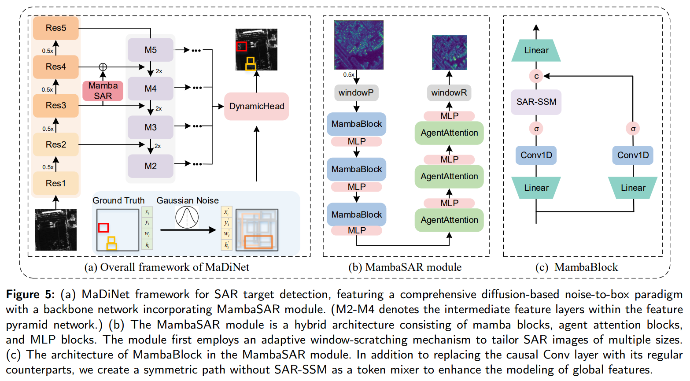

# Vision Mamba in Remote Sensing: A Comprehensive Survey of Techniques, Applications and Outlook

### News:
- 2025.04.07: The content had been added
- 2025.04.05: The repository was created

## Contents
- [Mamba](#mamba)
- [Related Survey](#related-survey)
- [Vision Mamba Backbone](#vision-mamba-backbone)
- [Vision Mamba in Remote Sensing](#vision-mamba-in-remote-sensing)
  - [Classification](#classification)
  - [Segmentation](#segmentation)
    - [Vanilla Segmentation](#semantic-segmentation)
    - [Interactive Segmentation](#interactive-segmentation)
    - [Boundary Segmentation](#boundary-segmentation)
  - [Detection](detection)
    - [Object Detection](#object-detection)
    - [Target Detection](#target-detection)
    - [Object Tracking](#object-tracking)
    - [Object Counting](#object-counting)
  - [Change Detection](#change-detection)
    - [Change Detection](#change-detection)
    - [Change Detection Captioning](change-detection-captioning)
  - [Super-Resolution](#super-resolution)
    - [Super-Resolution](#super-resolution)
    - [Pan-Sharpening](#pan-sharpening)
    - [Down-Scaling](#down-scaling)
  - [Image Restoration](#image-restoration)
    - [Cloud Removal](#cloud-removal)
    - [Shadow Removal](#shadow-removal)
    - [Dehazing](#dehazing)
    - [Denoising](#denoising)
    - [Rain Removal](#rain-removal)
    - [HSI Reconstruction](#hsi-reconstruction)
  - [Spectral Translation](#spectral-translation)

## Mamba

## Related Survey

## Vision Mamba Backbone

# Vision Mamba in Remote Sensing
We document these papers according to different downstream tasks. All dates are the received date.

## Classification
| Venue(received, accepted)| Paper | Figure    | Link | Code         |
| :--------  | :---- | :-------- | :--- | :----------- |
|LGRS(24.03.28, 24.05.27)|RSMamba:Remote Sensing Image Classification With State Space Model ||[Link](https://ieeexplore.ieee.org/abstract/document/10542538)|[Code](https://github.com/KyanChen/RSMamba)|
|arXiv(24.04.12, -)|HSIMamba:Hyperpsectral Imaging Efficient Feature Learning with Bidirectional State Space for Classification ||[Link](https://arxiv.org/abs/2404.00272)|[Code](https://github.com/Judyxyang/HSImamba)|
|arXiv(24.04.12, -)|SpectralMamba:Efficient Mamba for Hyperspectral Image Classification ||[Link](https://arxiv.org/abs/2404.08489)||
|TGRS(24.04.24, 24.07.10)|MambaHSI:Spatial–Spectral Mamba for Hyperspectral Image Classification ||[Link](https://ieeexplore.ieee.org/abstract/document/10604894)|[Code](https://github.com/li-yapeng/MambaHSI)|
|TGRS(24.04.28, 25.01.17)|S2Mamba:A Spatial-spectral State Space Model for Hyperspectral Image Classification ||[Link](https://ieeexplore.ieee.org/abstract/document/10844849)|[Code](https://github.com/PURE-melo/S2Mamba)|
|arXiv(24.04.29, -)|Spectral-Spatial Mamba for Hyperspectral Image Classification ||[Link](https://arxiv.org/abs/2404.18401)|[Code](https://github.com/mengduanjinghua/Spectral-spatial-Mamba-for-HSIC)|
|TGRS(24.05.11, 24.10.23)|GraphMamba:An Efficient Graph Structure Learning Vision Mamba for Hyperspectral Image Classification ||[Link](https://ieeexplore.ieee.org/abstract/document/10746459)|[Code](https://github.com/ahappyyang/GraphMamba)|
|TGRS(24.05.14, 24.10.14)|HyperMamba:A Spectral–Spatial Adaptive Mamba for Hyperspectral Image Classification ||[Link](https://ieeexplore.ieee.org/abstract/document/10720896)|[Code](https://github.com/chiangliu/HyperMamba)|
|JSTARS(24.05.17, 24.09.30)|Rethinking Scanning Strategies with Vision Mamba in Semantic Segmentation of Remote Sensing Imagery:An Experimental Study ||[Link](https://ieeexplore.ieee.org/abstract/document/10703181)||
|Signal Processing(24.05.18, 24.08.18)|State space models meet transformers for hyperspectral image classification ||[Link](https://www.sciencedirect.com/science/article/pii/S0165168424002895?casa_token=VVB7b0RZUQcAAAAA:wtKXPTCkwUdcMeRFnzeUBqbnjjxSftmUmYEFdWRqjFYoEn7wESjqT6m0tOrAkSf3j4cfGwO_wZc)|[Code](https://github.com/PPPPPsanG/MamTrans)|
|TGRS(24.06.02, 24.09.29)|3DSS-Mamba:3D-Spectral-Spatial Mamba for Hyperspectral Image Classification ||[Link](https://ieeexplore.ieee.org/abstract/document/10703171)|[Code](https://github.com/IIP-Team/3DSS-Mamba)|
|IJAEOG(24.06.10, 24.08.10)|A local enhanced mamba network for hyperspectral image classification ||[Link](https://www.sciencedirect.com/science/article/pii/S1569843224004461)||
|TGRS(24.06.11, 24.12.03)|DualMamba:A Lightweight Spectral-Spatial Mamba-Convolution Network for Hyperspectral Image Classification ||[Link](https://ieeexplore.ieee.org/abstract/document/10798573)||
|Image and Vision Computing(24.07.10, 24.12.09)|HSIRMamba:An effective feature learning for hyperspectral image classification using residual Mamba ||[Link](https://www.sciencedirect.com/science/article/pii/S026288562400492X?casa_token=klRlvtoQb5MAAAAA:zNhAv65q7Dbf2NfsoY2hEhMDa1S-42H9AiMFUYMY09XYWiDZqPgdsRI6j-2W8kqsXjZpQCvzQyA)|[Code](https://github.com/RajatArya22/HSIRMamba)|
|TGRS(24.07.12, 24.12.16)|Contour-Enhanced Visual State-Space Model for Remote Sensing Image Classification||[Link](https://ieeexplore.ieee.org/abstract/document/10810482)|[Code](https://github.com/yanliyue/Contour-enhanced-Visual-State-Space-Model)|
|Neurocomputing(24.08.01, 24.10.12)|Mamba-in-Mamba:Centralized Mamba-Cross-Scan in Tokenized Mamba Model for Hyperspectral image classification ||[Link](https://www.sciencedirect.com/science/article/pii/S0925231224015224)||
|TGRS(24.08.13, 25.01.05)|RSVMamba for Tree Species Classification Using UAV RGB Remote Sensing Images ||[Link](https://ieeexplore.ieee.org/abstract/document/10851291)||
|Remote Sensing Letters(24.08.17, 25.02.06)|Multi-head Spatial-Spectral Mamba for Hyperspectral Image Classification ||[Link](https://www.tandfonline.com/doi/full/10.1080/2150704X.2025.2461330?casa_token=aiHhjBYm8d4AAAAA%3AYAAlKRw2LBHmpG3hnuHLaHsacJhAvjohmX-EHfW6f394sq-TWjpM8bT2AQi_Sjfj7iLJpsY7A_BJBg4)|[Code](https://github.com/mahmad000/MHSSMamba)|
|JSTARS(24.08.18, 25.01.04)|Semantic Tokenization-based Mamba for Hyperspectral Image Classification ||[Link](https://ieeexplore.ieee.org/abstract/document/10838328)|[Code](https://github.com/AlanLowell/STMamba)|
|LGRS(24.08.28, 24.10.20)|S2CrossMamba:Spatial–Spectral Cross-Mamba for Multimodal Remote Sensing Image Classification ||[Link](https://ieeexplore.ieee.org/abstract/document/10738515)|[Code](https://github.com/HyperSystemAndImageProc/S2CrossMamba)|
|RS(24.09.01, 24.10.28)|AFA–Mamba:Adaptive Feature Alignment with Global–Local Mamba for Hyperspectral and LiDAR Data Classification ||[Link](https://www.mdpi.com/2072-4292/16/21/4050)||
|TGRS(24.09.10, 24.11.12)|IGroupSS-Mamba:Interval Group Spatial–Spectral Mamba for Hyperspectral Image Classification ||[Link](https://ieeexplore.ieee.org/abstract/document/10756788)| [Code](https://github.com/IIP-Team/IGroupSS-Mamba)|
|TGRS(24.09.12, 24.11.21)|Dynamic Token Augmentation Mamba for Cross-Scene Classification of Hyperspectral Image ||[Link](https://ieeexplore.ieee.org/abstract/document/10768958)||
|JSTARS(24.09.12, 24.11.20)|Lightweight Spatial–Spectral Shift Module With Multihead MambaOut for Hyperspectral Image Classification ||[Link](https://ieeexplore.ieee.org/abstract/document/10767195)||
|TGRS(24.09.13, 25.01.07)|MSFMamba:Multi-Scale Feature Fusion State Space Model for Multi-Source Remote Sensing Image Classification ||[Link](https://ieeexplore.ieee.org/abstract/document/10856240)|[Code](https://github.com/oucailab/MSFMamba)|
|arXiv(24.09.15, -)|SITSMamba for Crop Classification based on Satellite Image Time Series ||[Link](https://arxiv.org/abs/2409.09673)|[Code](https://github.com/XiaoleiQinn/SITSMamba)|
|sensors(24.09.24, 24.10.26)|Bidirectional Mamba with Dual-Branch Feature Extraction for Hyperspectral Image Classification ||[Link](https://www.mdpi.com/1424-8220/24/21/6899)||
|LGRS(24.10.03, 24.11.25)|WaveMamba:Spatial–Spectral Wavelet Mamba for Hyperspectral Image Classification ||[Link](https://ieeexplore.ieee.org/abstract/document/10750064)|[Code](https://github.com/mahmad000/WaveMamba)|
|TGRS(24.10.19, 24.12.19)|Hyperspectral Image Classification With Mamba ||[Link](https://ieeexplore.ieee.org/abstract/document/10812905)|[Code](https://github.com/danfenghong/IEEE_TGRS_MambaLG)|
|RS(24.10.21, 24.12.10)|SSUM:Spatial–Spectral Unified Mamba for Hyperspectral Image Classification ||[Link](https://www.mdpi.com/2072-4292/16/24/4653)|[Code](https://github.com/lronkitty/SSUMamba)|
|TGRS(24.11.05, 25.01.02)|A Mamba-aware Spatial Spectral Cross-modal Network for Remote Sensing Classification ||[Link](https://ieeexplore.ieee.org/abstract/document/10829637)|[Code](https://github.com/ru-willow/CMSI-Mamba)|
|SSRN(24.11.25, -)|MSTFNet:A Mamba and Dual Swin-Transformer d Fusion Network for Remote Sensing Image Classification for Precision Agriculture Land Processing||[Link](https://papers.ssrn.com/sol3/papers.cfm?abstract_id=5033170)||
|Neurocomputing(24.12.06, 25.03.08)|Spatial and Spatial-Spectral Morphological Mamba for Hyperspectral Image Classification ||[Link](https://www.sciencedirect.com/science/article/pii/S0925231225006678?casa_token=ezvw47O6v2wAAAAA:_FGQkXxZnjxT4L7cfh6alOYJ8aICgvlN0w1bpZVUWMuWt1Ci-HDYm7pv4TAIJiFm1cDQkFKLpTI)|[Code](https://github.com/mahmad000/MorpMamba)|
|SSRN(25.01.25, -)|Multi-layer Graph Convolution Discriminative Mamba for Hyperspectral Image Classification ||[Link](https://papers.ssrn.com/sol3/papers.cfm?abstract_id=5111366)||
|TCSVT(-, 25.01.29)|MLMamba:A Mamba-based Efficient Network for Multi-label Remote Sensing Scene Classification ||[Link](https://ieeexplore.ieee.org/abstract/document/10857393)|[Code](https://github.com/TangXu-Group/multilabelRSSC/tree/main/MLMamba)|

## Segmentation

### Semantic Segmentation
| Venue(received, accepted)| Paper | Figure    | Link | Code         |
| :--------  | :---- | :-------- | :--- | :----------- |
|TGRS(24.04.10, 24.07.05)|RS-Mamba for Large Remote Sensing Image Dense Prediction||[Link](https://ieeexplore.ieee.org/abstract/document/10589665)|[Code](https://github.com/walking-shadow/Official_Remote_Sensing_Mamba)|
|TGRS(24.05.15, 24.06.10)|RS3Mamba:Visual State Space Model for Remote Sensing Image Semantic Segmentation ||[Link](https://ieeexplore.ieee.org/abstract/document/10556777)|[Code](https://github.com/sstary/SSRS)|
|arXiv(24.05.17, -)|CM-UNet:Hybrid CNN-Mamba UNet for Remote Sensing Image Semantic Segmentation ||[Link](https://arxiv.org/abs/2405.10530)|[Code](https://github.com/XiaoBuL/CM-Unet)|
|RS(24.05.27, 24.07.15)|A Novel Mamba Architecture with a Semantic Transformer for Efficient Real-Time Remote Sensing Semantic Segmentation ||[Link](https://www.mdpi.com/2072-4292/16/14/2620)||
|RS(24.06.12, 24.09.13)|Link Aggregation for Skip Connection–Mamba:Remote Sensing Image Segmentation Network Based on Link Aggregation Mamba ||[Link](https://www.mdpi.com/2072-4292/16/19/3622)||
|TGRS(24.06.13, 24.09.08)|Joint Classification of Hyperspectral and LiDAR Data Based on Mamba ||[Link](https://ieeexplore.ieee.org/abstract/document/10679212)|[Code](https://github.com/Dilingliao/HLMamba)|
|arXiv(24.06.16, -)|PyramidMamba:Rethinking Pyramid Feature Fusion with Selective Space State Model for Semantic Segmentation of Remote Sensing Imagery ||[Link](https://arxiv.org/abs/2406.10828)||
|applied sciences(24.06.25, 24.08.22)|LDMNet:Enhancing the Segmentation Capabilities of Unmanned Surface Vehicles in Complex Waterway Scenarios ||[Link](https://www.mdpi.com/2076-3417/14/17/7706)|[Code](https://github.com/thalitadru/LDMnet-pytorch)|
|LGRS(24.07.22, 24.10.04)|A Mamba-Diffusion Framework for Multimodal Remote Sensing Image Semantic Segmentation ||[Link](https://ieeexplore.ieee.org/abstract/document/10733944)|[Code](https://github.com/WenliangDu/MambaDiffusion)|
|The Photogrammetric Record(24.08.08, 25.01.02)|An Integrated Segmentation Framework Utilizing Mamba Fusion for Optical and SAR Images ||[Link](https://onlinelibrary.wiley.com/doi/full/10.1111/phor.12534?casa_token=0mAvUbXjTtUAAAAA%3ABsd-yzLz2jhb_CDwf4U7o0u9sIdIeGncU2f62jVJahHyyRLY_1nN5GC5LD9ScL7QBbO_vP0-a_DvvyY)||
|Geocarto International(24.08.26, 24.12.05)|EGCM-UNet:Edge Guided Hybrid CNN-Mamba UNet for farmland remote sensing image semantic segmentation ||[Link](https://www.tandfonline.com/doi/full/10.1080/10106049.2024.2440407)||
|ISPRS(24.08.27, 25.01.16)|Accurate semantic segmentation of very high-resolution remote sensing images considering feature state sequences:From benchmark datasets to urban applications ||[Link](https://www.sciencedirect.com/science/article/pii/S0924271625000176?casa_token=_D9wfM1mmwgAAAAA:sP0GEasA_QXApuP03QAEG4YEnYrOkaAH0vHRYfvy5BAk-YnLF36gTijTjXlPDFCvsMKN05mbO0M)|[Code](https://github.com/KotlinWang/UrbanSSF)|
|arXiv(24.09.10, -)|PPMamba:A Pyramid Pooling Local Auxiliary SSM-Based Model for Remote Sensing Image Semantic Segmentation  ||[Link](https://arxiv.org/abs/2409.06309)|[Code](https://github.com/Jerrymo59/PPMambaSeg)|
|sensor(24.10.04, 24.11.12)|MFMamba:A Mamba-Based Multi-Modal Fusion Network for Semantic Segmentation of Remote Sensing Images ||[Link](https://www.mdpi.com/1424-8220/24/22/7266)|[Code](https://github.com/YanWang-WHPU/MFMamba)|
|drones(24.10.04, 24.11.03)|Mamba-UAV-SegNet:A Multi-Scale Adaptive Feature Fusion Network for Real-Time Semantic Segmentation of UAV Aerial Imagery ||[Link](https://www.mdpi.com/2504-446X/8/11/671)||
|arXiv(24.10.08, -)|Remote Sensing Image Segmentation Using Vision Mamba and Multi-Scale Multi-Frequency Feature Fusion ||[Link](https://arxiv.org/abs/2410.05624)||
|Heliyon(24.10.15, -)|Samba:Semantic segmentation of remotely sensed images with state space model ||[Link](https://www.cell.com/heliyon/fulltext/S2405-8440(24)14526-4)|[Code](https://github.com/zhuqinfeng1999/Samba)|
|TGRS(24.10.15, 24.11.23)|PPMamba:Enhancing Semantic Segmentation in Remote Sensing Imagery by SS2D ||[Link](https://ieeexplore.ieee.org/abstract/document/10769411)|[Code](https://github.com/Jerrymo59/PPMambaSeg)|
|TGRS(24.10.18, 24.12.19)|LGMamba:Large-Scale ALS Point Cloud Semantic Segmentation With Local and Global State-Space Model ||[Link](https://ieeexplore.ieee.org/abstract/document/10812773)|
|applied sciences(24.12.04, 25.01.22)|Multimodal Natural Disaster Scene Recognition with Integrated Large Model and Mamba ||[Link](https://www.mdpi.com/2076-3417/15/3/1149)|[Code](https://github.com/22Shao/Mamba-MDRNet)|
|arXiv(25.02.01)|SatMamba: Development of Foundation Models for Remote Sensing Imagery Using State Space Models ||[Link](https://arxiv.org/abs/2502.00435)|[Code](https://github.com/mdchuc/HRSFM)|

### Interactive Segmentation
| Venue(received, accepted)| Paper | Figure    | Link | Code         |
| :--------  | :---- | :-------- | :--- | :----------- |
|CASSP(24.09.05, 25.03.07)|UV-Mamba:A DCN-Enhanced State Space Model for Urban Village Boundary Identification in High-Resolution Remote Sensing Images ||[Link](https://ieeexplore.ieee.org/abstract/document/10888896)|[Code](https://github.com/Devin-Egber/UV-Mamba)|

### Boundary Segmentation
| Venue(received, accepted)| Paper | Figure    | Link | Code         |
| :--------  | :---- | :-------- | :--- | :----------- |
|JSTARS(24.09.04, 24.10.31)|An Interactive Prompt Based Network for Urban Floods Area Segmentation Using UAV Images ||[Link](https://ieeexplore.ieee.org/abstract/document/10753337)||

## Detection

### Object Detection
| Venue(received, accepted)| Paper | Figure    | Link | Code         |
| :--------  | :---- | :-------- | :--- | :----------- |
|SIVP(24.06.07, 24.08.17)|YOLO-Mamba:object detection method for infrared aerial images ||[Link](https://link.springer.com/article/10.1007/s11760-024-03507-4)||
|sensors(24.06.20, 24.07.29)|Accurate UAV Small Object Detection Based on HRFPN and EfficentVMamba ||[Link](https://www.mdpi.com/1424-8220/24/15/4966)||
|TGRS(24.07.03, 24.08.25)|Mask-Guided Mamba Fusion for Drone-Based Visible–Infrared Vehicle Detection ||[Link](https://ieeexplore.ieee.org/abstract/document/10659747)||
|arXiv(24.07.11, -)|DMM:Disparity-guided Multispectral Mamba for Oriented Object Detection in Remote Sensing ||[Link](https://arxiv.org/abs/2407.08132)|[Code](https://github.com/Another-0/DMM)|
|arXiv(24.10.17, -)|RemoteDet-Mamba:A Hybrid Mamba-CNN Network for Multi-modal Object Detection in Remote Sensing Images ||[Link](https://arxiv.org/abs/2410.13532)||
|RS(24.10.29, 24.11.26)|Hyperspectral Object Detection Based on Spatial–Spectral Fusion and Visual Mamba ||[Link](https://www.mdpi.com/2072-4292/16/23/4482)||
|CCSB(-, 24.11.04)|YOLOv10 and Mamba-based Super-Resolution for Smart Rose Growth Monitoring Using UAV Imagery ||[Link](https://ieeexplore.ieee.org/abstract/document/10735472)||
|arXiv(24.11.12,-)|MaDiNet:Mamba Diffusion Network for SAR Target Detection ||[Link](https://arxiv.org/abs/2411.07500)|[Code](https://github.com/JoyeZLearning/MaDiNet)|
|SSRN(24.12.16, -)|Mamba Enhanced You Only Look Once Network With  Multiscale Spatial Attention For Remote Sensing Object w Detection||[Link](https://papers.ssrn.com/sol3/papers.cfm?abstract_id=5059656)|[Code](https://github.com/woshio/ME-MSA-YOLO)|
|arXiv(24.12.24, -)|COMO:Cross-Mamba Interaction and Offset-Guided Fusion for Multimodal Object Detection ||[Link](https://arxiv.org/abs/2412.18076)|[Code](https://github.com/luluyuu/COMO)|

### Target Detection
| Venue(received, accepted)| Paper | Figure    | Link | Code         |
| :--------  | :---- | :-------- | :--- | :----------- |
|TGRS(24.06.23, 24.10.11)|MiM-ISTD:Mamba-in-Mamba for Efficient Infrared Small-Target Detection ||[Link](https://ieeexplore.ieee.org/abstract/document/10740056)|[Code](https://github.com/txchen-USTC/MiM-ISTD)|
|TGRS(24.09.18, 25.02.26)|HTD-Mamba:Efficient Hyperspectral Target Detection with Pyramid State Space Model ||[Link](https://ieeexplore.ieee.org/abstract/document/10908894)|[Code](https://github.com/shendb2022/HTD-Mamba)|
|RS(24.11.21, 25.01.26)|HMCNet:A Hybrid Mamba–CNN UNet for Infrared Small Target Detection ||[Link](https://www.mdpi.com/2072-4292/17/3/452)||

### Object Tracking
| Venue(received, accepted)| Paper | Figure    | Link | Code         |
| :--------  | :---- | :-------- | :--- | :----------- |
|JSTARS(24.08.06, 24.09.07)|TrackingMamba:Visual State Space Model for Object Tracking||[Link](https://ieeexplore.ieee.org/abstract/document/10678881)|[Code](https://github.com/KustTeamWQW/TrackingMamba)|

### Object Counting
| Venue(received, accepted)| Paper | Figure    | Link | Code         |
| :--------  | :---- | :-------- | :--- | :----------- |
|arXiv(25.01.12, -)|Mamba-MOC:A Multicategory Remote Object Counting via State Space Model||[Link](https://arxiv.org/abs/2501.06697)|[Code](https://github.com/lp-094/Mamba-MOC)|

## Change Detection

### Change Detection 
| Venue(received, accepted)| Paper | Figure    | Link | Code         |
| :--------  | :---- | :-------- | :--- | :----------- |
|TGRS(24.04.10, 24.07.05)  |RS-Mamba for Large Remote Sensing Image Dense Prediction||[Link](https://ieeexplore.ieee.org/abstract/document/10589665)|[Code](https://github.com/walking-shadow/Official_Remote_Sensing_Mamba)|
|TGRS(24.04.15, 24.06.17)  |ChangeMamba:Remote Sensing Change Detection with Spatio-Temporal State Space Model ||[Link](https://ieeexplore.ieee.org/abstract/document/10565926)|[Code](https://github.com/ChenHongruixuan/MambaCD)|
|TGRS(24.04.25, 24.10.15)  |ConMamba:CNN and SSM High-Performance Hybrid Network for Remote Sensing Change Detection ||[Link](https://ieeexplore.ieee.org/abstract/document/10750064)||
|arXiv(24.06.06, -)        |CDMamba:Remote Sensing Image Change Detection with Mamba ||[Link](https://arxiv.org/abs/2406.04207)|[Code](https://github.com/zmoka-zht/CDMamba)|
|RS(24.08.15, 24.09.27)    |Iterative Mamba Diffusion Change-Detection Model for Remote Sensing||[Link](https://www.mdpi.com/2072-4292/16/19/3651)|[Code](https://github.com/LiuFxxx/IMDCD)|
|RS(24.09.12, 24.11.08)    |DC-Mamba:A Novel Network for Enhanced Remote Sensing Change Detection in Difficult Cases ||[Link](https://www.mdpi.com/2072-4292/16/22/4186)||
|RS(24.10.19, 24.10.30)    |TTMGNet:Tree Topology Mamba-Guided Network Collaborative Hierarchical Incremental Aggregation for Change Detection ||[Link](https://www.mdpi.com/2072-4292/16/21/4068)|[Code](https://github.com/COMPHZ/TTMGNet)|
|TGRS(24.10.21, 24.11.12)  |A Novel Remote Sensing Image Change Detection Approach Based on Multilevel State Space Model ||[Link](https://ieeexplore.ieee.org/abstract/document/10756674)|[Code](https://github.com/121zzy/MF-Mamba.git)|
|RS(24.10.27, 24.12.09)    |An Unsupervised Remote Sensing Image Change Detection Method Based on RVMamba and Posterior Probability Space Change Vector ||[Link](https://www.mdpi.com/2072-4292/16/24/4656)||
|JSTARS(24.11.26, 25.01.14)|LCCDMamba:Visual State Space Model for Land Cover Change Detection of VHR Remote Sensing Images ||[Link](https://ieeexplore.ieee.org/abstract/document/10845192)|[Code](https://github.com/juncyan/lccdmamba)|
|arXiv(25.01.26, -)        |CD-Lamba:Boosting Remote Sensing Change Detection via a Cross-Temporal Locally Adaptive State Space Model ||[Link](https://arxiv.org/abs/2501.15455)|[Code](https://github.com/xwmaxwma/rschange)|

### Change Detection Captioning
| Venue(received, accepted)| Paper | Figure    | Link | Code         |
| :--------  | :---- | :-------- | :--- | :----------- |
|LGRS(24.05.02, 24.05.20)|RSCaMa:Remote Sensing Image Change Captioning With State Space Model ||[Link](https://ieeexplore.ieee.org/abstract/document/10537177)|[Code](https://github.com/Chen-Yang-Liu/RSCaMa)|

## Super-Resolution

### Super-Resolution
| Venue(received, accepted)| Paper | Figure    | Link | Code         |
| :--------  | :---- | :-------- | :--- | :----------- |
|TMM(24.05.01, 24.08.28)|Frequency-Assisted Mamba for Remote Sensing Image Super-Resolution||[Link](https://ieeexplore.ieee.org/abstract/document/10817590)|[Code](https://github.com/XY-boy/FreMamba)|
|JSTARS(24.06.11, 24.09.23)|Spatial–Spectral Interaction Super-Resolution CNN–Mamba Network for Fusion of Satellite Hyperspectral and Multispectral Image ||[Link](https://ieeexplore.ieee.org/abstract/document/10695805)||
|RS(24.07.22, 24.08.27)|ConvMambaSR:Leveraging State-Space Models and CNNs in a Dual-Branch Architecture for Remote Sensing Imagery Super-Resolution ||[Link](https://www.mdpi.com/2072-4292/16/17/3254)||
|LGRS(24.08.07, 24.08.28)|MambaFormerSR:A Lightweight Model for Remote-Sensing Image Super-Resolution ||[Link](https://ieeexplore.ieee.org/abstract/document/10663411)||
|IJRS(24.08.16, 24.12.06)|UVMSR:a novel approach to hyperspectral image super-resolution by fusing U-Net and Mamba ||[Link](https://www.tandfonline.com/doi/full/10.1080/01431161.2024.2443619?casa_token=JHK8qMLi11UAAAAA%3AODHxgFVYckTIQCOTqg6wRfL3_ixHH1ocGOrRU_9Y0Pv7YyBGJRW2KfMwyIsEbXSllfZ7zploxoAc69o)|[Code](https://github.com/TeresaTing/UVMSR)|
|CVPR(24.12.28, 25.03.22)|MaIR:A Locality-and Continuity-Preserving Mamba for Image Restoration ||[Link](https://arxiv.org/abs/2412.20066)|[Code](https://github.com/XLearning-SCU/2025-CVPR-MaIR)|
|PRAI(25.01.14, 25.01.14)|Mamba-Based Residual Network for Remote Sensing Image Super-Resolution ||[Link](https://ieeexplore.ieee.org/abstract/document/10826984)||
|arXiv(25.01.30, -)|HSRMamba:Contextual Spatial-Spectral State Space Model for Single Hyperspectral Super-Resolution ||[Link](https://arxiv.org/abs/2501.18500)||

### Pan-Sharpening
| Venue(received, accepted)| Paper | Figure    | Link | Code         |
| :--------  | :---- | :-------- | :--- | :----------- |
|Information Fusion(24.07.13, 24.10.29)|Pan-Mamba:Effective pan-sharpening with state space model ||[Link](https://www.sciencedirect.com/science/article/pii/S1566253524005578?casa_token=T-IXNVum8_IAAAAA:ElLzx-L4UQj-3JX6TD9GybybHNRGe15wgXvhQlG-9ejAfg5YNLYmj-s7z9h6F-MpGm9wj-CtEUE)|[Code](https://github.com/alexhe101/Pan-Mamba)|
|TGRS(24.07.25, 24.10.30)|FusionMamba:Efficient Remote Sensing Image Fusion With State Space Model ||[Link](https://ieeexplore.ieee.org/abstract/document/10750233)|[Code](https://github.com/PSRben/FusionMamba)|
|TGRS(24.08.17, 24.11.18)|Supervised Detail-guided Multi-scale State Space Model for Pan-sharpening ||[Link](https://ieeexplore.ieee.org/abstract/document/10812822)|[Code](https://github.com/zhaomengjiao123/SDMSPan)|
|symmetry(24.11.13, 24.12.13)|Conditional Skipping Mamba Network for Pan-Sharpening ||[Link](https://www.mdpi.com/2073-8994/16/12/1681)||

### Down-Scaling
| Venue(received, accepted)| Paper | Figure    | Link | Code         |
| :--------  | :---- | :-------- | :--- | :----------- |
|TGRS(24.08.25, 24.11.07)|MambaDS:Near-Surface Meteorological Field Downscaling With Topography Constrained Selective State-Space Modeling ||[Link](https://ieeexplore.ieee.org/abstract/document/10752514)||

## Image Restoration

### Cloud Removal
| Venue(received, accepted)| Paper | Figure    | Link | Code         |
| :--------  | :---- | :-------- | :--- | :----------- |
|arXiv(24.05.16, -)|RSDehamba:Lightweight Vision Mamba for Remote Sensing Satellite Image Dehazing ||[Link](https://arxiv.org/abs/2405.10030)||
|TGRS(24.08.07, 25.01.02)|FMambaIR:A Hybrid State Space Model and Frequency Domain for Image Restoration ||[Link](https://ieeexplore.ieee.org/abstract/document/10834441)|[Code](https://github.com/mickoluan/FMambaIR)|
|SIVP(24.09.19, 24.12.07)|Lightweight vision Mamba for weather-degraded remote sensing image restoration ||[Link](https://link.springer.com/article/10.1007/s11760-024-03767-0)||
|TGRS(24.09.22, 24.12.13)|Mamba-CR:A State-Space Model for Remote Sensing Image Cloud Removal ||[Link](https://ieeexplore.ieee.org/abstract/document/10806801)||
|RS(25.01.06, 25.01.27)|Weamba:Weather-Degraded Remote Sensing Image Restoration with Multi-Router State Space Model ||[Link](https://www.mdpi.com/2072-4292/17/3/458)||

### Shadow Removal
| Venue(received, accepted)| Paper | Figure    | Link | Code         |
| :--------  | :---- | :-------- | :--- | :----------- |
|TGRS(24.08.15, 25.01.05)|RSMamba: Biologically Plausible Retinex-Based Mamba for Remote Sensing Shadow Removal||[Link](https://ieeexplore.ieee.org/abstract/document/10833852)||

### Dehazing
| Venue(received, accepted)| Paper | Figure    | Link | Code         |
| :--------  | :---- | :-------- | :--- | :----------- |
|arxiv(24.06.09, -)|HDMba:Hyperspectral Remote Sensing Imagery Dehazing with State Space Model ||[Link](https://arxiv.org/abs/2406.05700)|[Code](https://github.com/RsAI-lab/HDMba)|
|Mathematical Problems of Computer Science(-, 24,12,01)|Mamba-based Thermal Image Dehazing ||[Link](http://93.187.165.2/index.php/mpcs/article/view/866)||
|RS(25.01.06, 25.01.27)|Weamba:Weather-Degraded Remote Sensing Image Restoration with Multi-Router State Space Model ||[Link](https://www.mdpi.com/2072-4292/17/3/458)||

### Denoising
| Venue(received, accepted)| Paper | Figure    | Link | Code         |
| :--------  | :---- | :-------- | :--- | :----------- |
|arXiv(24.04.15, -)|HSIDMamba:Exploring Bidirectional State-Space Models for Hyperspectral Denoising ||[Link](https://arxiv.org/abs/2404.09697)||
|TGRS(24.06.09, 24.08.15)|SSUMamba:Spatial–Spectral Selective State Space Model for Hyperspectral Image Denoising ||[Link](https://ieeexplore.ieee.org/abstract/document/10643108)|[Code](https://github.com/lronkitty/SSUMamba)|

### Rain Removal
| Venue(received, accepted)| Paper | Figure    | Link | Code         |
| :--------  | :---- | :-------- | :--- | :----------- |
|arXiv(24.08.31, -)|A Hybrid Transformer-Mamba Network for Single Image Deraining ||[Link](https://arxiv.org/abs/2409.00410)|[Code](https://github.com/sunshangquan/TransMamba)|
|RS(25.01.06, 25.01.27)|Weamba:Weather-Degraded Remote Sensing Image Restoration with Multi-Router State Space Model ||[Link](https://dl.acm.org/doi/abs/10.1145/3664647.3680648?casa_token=6gjQ10LnqlIAAAAA:qJYQwQcP8heuc3I_iqWs0wFMYtUos-PFmCxqgrsPT5wB5EX-9HNlKoa5SgtIYXhsEDvGNxm0uN50)||

### HSI Reconstruction
| Venue(received, accepted)| Paper | Figure    | Link | Code         |
| :--------  | :---- | :-------- | :--- | :----------- |
|arXiv(24.08.31, -)|Dual Hyperspectral Mamba for Efficient Spectral Compressive Imaging ||[Link](https://arxiv.org/abs/2406.00449)|[Code](https://github.com/JiahuaDong/DHM)|
|International Multimedia Conference(-, 24.10.28)|VmambaSCI:Dynamic Deep Unfolding Network with Mamba for Compressive Spectral Imaging ||[Link](https://dl.acm.org/doi/abs/10.1145/3664647.3680648?casa_token=6gjQ10LnqlIAAAAA:qJYQwQcP8heuc3I_iqWs0wFMYtUos-PFmCxqgrsPT5wB5EX-9HNlKoa5SgtIYXhsEDvGNxm0uN50)||

## Spectral Translation
| Venue(received, accepted)| Paper | Figure    | Link | Code         |
| :--------  | :---- | :-------- | :--- | :----------- |
|arXiv(24.08.15, -)|ColorMamba:Towards High-quality NIR-to-RGB Spectral Translation with Mamba ||[Link](https://arxiv.org/abs/2408.08087)|[Code](https://github.com/AlexYangxx/ColorMamba)|

