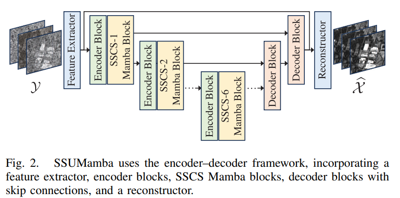

# Vision Mamba in Remote Sensing: A Comprehensive Survey of Techniques, Applications and Outlook

### News:
- 2025.04.05: The repository was created

## Contents
- [Mamba](#mamba)
- [Related Survey](#related-survey)
- [Vision Mamba Backbone](#vision-mamba-backbone)
- [Vision Mamba in Remote Sensing](#vision-mamba-in-remote-sensing)
  - [Classification](#classification)
  - [Segmentation](#segmentation)
    - [Vanilla Segmentation](#semantic-segmentation)
    - [Interactive Segmentation](#interactive-segmentation)
    - [Boundary Segmentation](#boundary-segmentation)
  - [Detection](detection)
    - [Object Detection](#object-detection)
    - [Target Detection](#target-detection)
    - [Object Tracking](#object-tracking)
    - [Object Counting](#object-counting)
  - [Change Detection](#change-detection)
    - [Change Detection](#change-detection)
    - [Change Detection Captioning](change-detection-captioning)
  - [Super-Resolution](#super-resolution)
    - [Super-Resolution](#super-resolution)
    - [Pan-Sharpening](#pan-sharpening)
    - [Down-Scaling](#down-scaling)
  - [Image Restoration](#image-restoration)
    - [Cloud Removal](#cloud-removal)
    - [Shadow Removal](#shadow-removal)
    - [Dehazing](#dehazing)
    - [Denoising](#denoising)
    - [Rain Removal](#rain-removal)
    - [HSI Reconstruction](#hsi-reconstruction)
  - [Spectral Translation](#spectral-translation)

## Mamba

## Related Survey

## Vision Mamba Backbone

# Vision Mamba in Remote Sensing
We document these papers according to different downstream tasks. All dates are the received date.

## Classification
| Venue(received, accepted)| Paper | Figure    | Link | Code         |
| :--------  | :---- | :-------- | :--- | :----------- |
|LGRS(24.03.28, 24.05.27)|RSMamba:Remote Sensing Image Classification With State Space Model ||[Link](https://ieeexplore.ieee.org/abstract/document/10542538)|[Code](https://github.com/KyanChen/RSMamba)|
|arXiv(24.04.12, -)|HSIMamba:Hyperpsectral Imaging Efficient Feature Learning with Bidirectional State Space for Classification ||[Link](https://arxiv.org/abs/2404.00272)|[Code](https://github.com/Judyxyang/HSImamba)|
|arXiv(24.04.12, -)|SpectralMamba:Efficient Mamba for Hyperspectral Image Classification ||[Link](https://arxiv.org/abs/2404.08489)||
|TGRS(24.04.24, 24.07.10)|MambaHSI:Spatial–Spectral Mamba for Hyperspectral Image Classification ||[Link](https://ieeexplore.ieee.org/abstract/document/10604894)|[Code](https://github.com/li-yapeng/MambaHSI)|
|TGRS(24.04.28, 25.01.17)|S2Mamba:A Spatial-spectral State Space Model for Hyperspectral Image Classification ||[Link](https://ieeexplore.ieee.org/abstract/document/10844849)|[Code](https://github.com/PURE-melo/S2Mamba)|
|arXiv(24.04.29, -)|Spectral-Spatial Mamba for Hyperspectral Image Classification ||[Link](https://arxiv.org/abs/2404.18401)|[Code](https://github.com/mengduanjinghua/Spectral-spatial-Mamba-for-HSIC)|
|TGRS(24.05.11, 24.10.23)|GraphMamba:An Efficient Graph Structure Learning Vision Mamba for Hyperspectral Image Classification ||[Link](https://ieeexplore.ieee.org/abstract/document/10746459)|[Code](https://github.com/ahappyyang/GraphMamba)|
|TGRS(24.05.14, 24.10.14)|HyperMamba:A Spectral–Spatial Adaptive Mamba for Hyperspectral Image Classification ||[Link](https://ieeexplore.ieee.org/abstract/document/10720896)|[Code](https://github.com/chiangliu/HyperMamba)|
|JSTARS(24.05.17, 24.09.30)|Rethinking Scanning Strategies with Vision Mamba in Semantic Segmentation of Remote Sensing Imagery:An Experimental Study ||[Link](https://ieeexplore.ieee.org/abstract/document/10703181)||
|Signal Processing(24.05.18, 24.08.18)|State space models meet transformers for hyperspectral image classification ||[Link](https://www.sciencedirect.com/science/article/pii/S0165168424002895?casa_token=VVB7b0RZUQcAAAAA:wtKXPTCkwUdcMeRFnzeUBqbnjjxSftmUmYEFdWRqjFYoEn7wESjqT6m0tOrAkSf3j4cfGwO_wZc)|[Code](https://github.com/PPPPPsanG/MamTrans)|
|()|||[Link]()|[Code]()|
|()|||[Link]()|[Code]()|
|()|||[Link]()|[Code]()|
|()|||[Link]()|[Code]()|

## Segmentation

### Semantic Segmentation

### Interactive Segmentation

### Boundary Segmentation

## Detection

### Object Detection

### Target Detection

### Object Tracking

### Object Counting

## Change Detection

### Change Detection 

### Change Detection Captioning

## Super-Resolution

### Super-Resolution

### Pan-Sharpening

### Down-Scaling

## Image Restoration

### Cloud Removal
| Venue(received, accepted)| Paper | Figure    | Link | Code         |
| :--------  | :---- | :-------- | :--- | :----------- |
|()|||[Link]()|[Code]()|
|()|||[Link]()|[Code]()|
|()|||[Link]()|[Code]()|
|()|||[Link]()|[Code]()|
|()|||[Link]()|[Code]()|

### Shadow Removal
| Venue(received, accepted)| Paper | Figure    | Link | Code         |
| :--------  | :---- | :-------- | :--- | :----------- |
|()|||[Link]()|[Code]()|
|()|||[Link]()|[Code]()|

### Dehazing
| Venue(received, accepted)| Paper | Figure    | Link | Code         |
| :--------  | :---- | :-------- | :--- | :----------- |
|()|||[Link]()|[Code]()|
|()|||[Link]()|[Code]()|
|()|||[Link]()|[Code]()|

### Denoising
| Venue(received, accepted)| Paper | Figure    | Link | Code         |
| :--------  | :---- | :-------- | :--- | :----------- |
|arXiv(24.04.15, -)|HSIDMamba:Exploring Bidirectional State-Space Models for Hyperspectral Denoising ||[Link](https://arxiv.org/abs/2404.09697)||
|TGRS(24.06.09, 24.08.15)|SSUMamba:Spatial–Spectral Selective State Space Model for Hyperspectral Image Denoising ||[Link](https://ieeexplore.ieee.org/abstract/document/10643108)|[Code](https://github.com/lronkitty/SSUMamba)|

### Rain Removal
| Venue(received, accepted)| Paper | Figure    | Link | Code         |
| :--------  | :---- | :-------- | :--- | :----------- |
|arXiv(24.08.31, -)|A Hybrid Transformer-Mamba Network for Single Image Deraining ||[Link](https://arxiv.org/abs/2409.00410)|[Code](https://github.com/sunshangquan/TransMamba)|
|RS(25.01.06, 25.01.27)|Weamba:Weather-Degraded Remote Sensing Image Restoration with Multi-Router State Space Model ||[Link](https://dl.acm.org/doi/abs/10.1145/3664647.3680648?casa_token=6gjQ10LnqlIAAAAA:qJYQwQcP8heuc3I_iqWs0wFMYtUos-PFmCxqgrsPT5wB5EX-9HNlKoa5SgtIYXhsEDvGNxm0uN50)||

### HSI Reconstruction
| Venue(received, accepted)| Paper | Figure    | Link | Code         |
| :--------  | :---- | :-------- | :--- | :----------- |
|arXiv(24.08.31, -)|Dual Hyperspectral Mamba for Efficient Spectral Compressive Imaging ||[Link](https://arxiv.org/abs/2406.00449)|[Code](https://github.com/JiahuaDong/DHM)|
|International Multimedia Conference(-, 24.10.28)|VmambaSCI:Dynamic Deep Unfolding Network with Mamba for Compressive Spectral Imaging ||[Link](https://dl.acm.org/doi/abs/10.1145/3664647.3680648?casa_token=6gjQ10LnqlIAAAAA:qJYQwQcP8heuc3I_iqWs0wFMYtUos-PFmCxqgrsPT5wB5EX-9HNlKoa5SgtIYXhsEDvGNxm0uN50)||

## Spectral Translation
| Venue(received, accepted)| Paper | Figure    | Link | Code         |
| :--------  | :---- | :-------- | :--- | :----------- |
|arXiv(24.08.15, -)|ColorMamba:Towards High-quality NIR-to-RGB Spectral Translation with Mamba ||[Link](https://arxiv.org/abs/2408.08087)|[Code](https://github.com/AlexYangxx/ColorMamba)|

